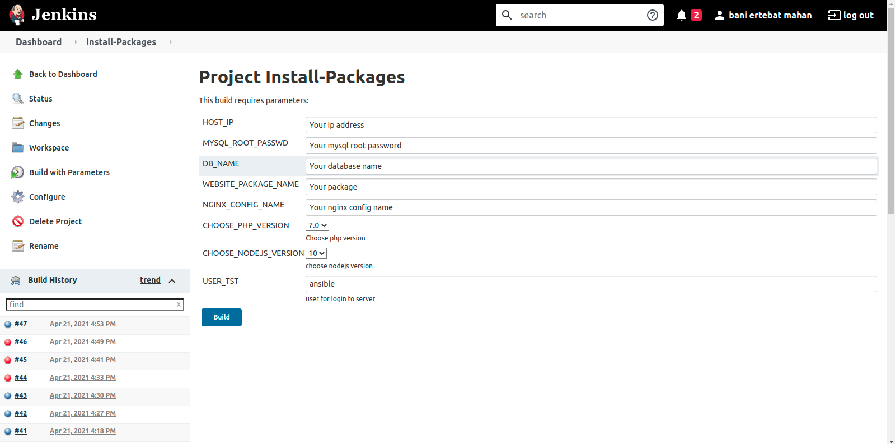
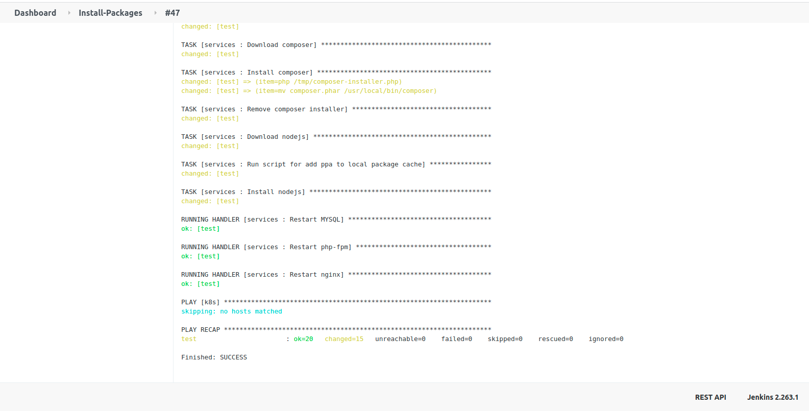

# Install-Packages
Installing Packages with their different version

#### Install the following packages by selecting a desired version
- composer
- nodejs
  - 10
  - 12
  - 14
  - 15
  - ...
- php
  - 7.0
  - 7.1
  - 7.2
  - 7.3
  - 7.4
  - ...
- nginx
  - comes with a basic configuration
- mysql
  - Set up the user's password and create a database

